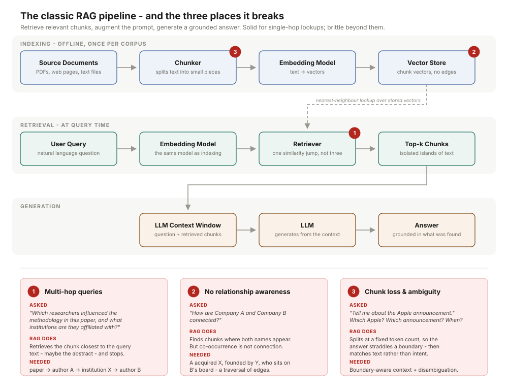
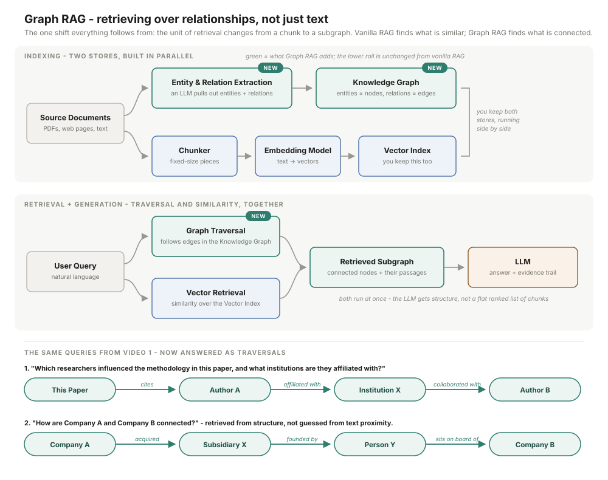

# Graph RAG: Build Knowledge Graph Powered Retrieval Systems

Course materials for **Graph RAG — Build Knowledge Graph Powered Retrieval Systems**

The course takes you from understanding *why standard RAG falls short* all the way to building a
knowledge-graph-powered retrieval system from scratch.

## Why This Course

If you have worked with RAG systems before, you have probably hit walls like these:

- **"Who influenced the ideas behind this paper?"** — your RAG system retrieves isolated chunks but
  completely misses the relationship chain between authors, citations, and references.
- **"How are these two companies connected?"** — the system gives you nothing useful, because the
  answer doesn't live in any single chunk. It lives across multiple documents, in the *edges*
  between entities.
- **"What led to this decision over the past six months?"** — flat vector search can't help, because
  it has no concept of time, causality, or multi-hop paths.

The question this course sits with: **what if your retrieval system could traverse relationships
instead of just matching text?**

## Learning Outcomes

By the end of the course you will be able to:

1. **Explain** exactly where and why vanilla RAG breaks on multi-hop, ambiguous, and
   relationship-heavy queries.
2. **Understand** Graph RAG architecture end to end — entities, relations, graph stores, retriever
   and generator layers.
3. **Build** a complete Graph RAG pipeline from scratch using real source documents.
4. **Compare** RAG vs. Graph RAG outputs side by side on the same queries and evaluate the
   difference yourself.
5. **Evaluate** your system using graph coverage, retrieval trace, faithfulness, and answer quality
   metrics.

## Course Structure

| Module | Focus |
| --- | --- |
| **Module 1 — Foundations** | A clear understanding of RAG, its limitations, and how Graph RAG improves retrieval. Starts with the first big question: *what is RAG and exactly where does it break?* |
| **Module 2 — Hands-on Build** | A deep dive into every component of the Graph RAG pipeline, then putting it all together. |
| **Capstone** | A working, evaluated system: podcast transcript QA built entirely on Graph RAG from start to finish. |

## Module 1 — Foundations

### 1.1 What is RAG, and where does it break?

**RAG** stands for **Retrieval Augmented Generation**. It works in three steps:

1. **Retrieve** — find the most relevant content from your documents based on the user's query.
2. **Augment** — take that retrieved content and add it to the LLM prompt as context.
3. **Generate** — the LLM produces a grounded, accurate answer using that context.

Simple and powerful. But there are specific situations where it breaks down.

#### The pipeline, end to end



Source documents — PDFs, web pages, any text files — go through a **chunker** that splits them into
smaller pieces. Each chunk is passed through an **embedding model** that converts text into vectors,
and those vectors are stored in a **vector store**. When a user sends a query, it goes through the
*same* embedding model. The **retriever** then searches the vector store for the most similar chunks,
those chunks are passed into the **LLM context window** along with the original question, and the
LLM generates the final answer.

#### Where RAG genuinely works well

Before critiquing RAG, it's worth being fair about where it earns its keep:

- **Factual lookups from a fixed document set.** Ask *"What is your refund policy?"* and, if the
  answer sits cleanly in one document, RAG will find it.
- **Single-hop Q&A over internal documents.** *"What does the contract say about termination?"* has a
  self-contained answer that RAG handles reliably.
- **Reduced hallucination.** The LLM now has real retrieved content to work from instead of guessing
  from training data alone.

RAG is not broken. It is a solid system for a specific class of problems. The question is what
happens when the queries get more complex.

#### Failure mode 1 — Multi-hop queries

> *"Which researchers influenced the methodology used in this paper, and what institutions are they
> affiliated with?"*

**What RAG does:** retrieves the chunk closest to that query text — maybe the abstract — and stops
there. It misses the citation chain entirely.

**What's actually needed:** a chain of reasoning. *Paper cites author A → affiliated with institution
X → who also collaborated with author B.* That is three hops. RAG has no mechanism to chain reasoning
across multiple documents or entities; it makes **one retrieval jump, not three**.

#### Failure mode 2 — No relationship awareness

> *"How are Company A and Company B connected?"*

**What RAG does:** searches for chunks containing both names and rewards co-occurrence. But
**co-occurrence is not connection**.

**What's actually needed:** a traversal. *Company A acquired subsidiary X → which was founded by
person Y → who sits on the board of Company B.* That chain does not live in any single chunk. It
exists in the structure *between* documents — in the **edges between entities**. RAG has no way to
see that structure; it treats every chunk as an isolated island.

#### Failure mode 3 — Chunk loss and ambiguity

Two related problems, both very common in practice.

- **The chunking problem.** The answer often sits across two chunks. The chunker splits at a fixed
  token count and neither chunk alone is useful — you lose the answer at the boundary.
- **The ambiguity problem.** *"Tell me about the Apple announcement."* Which Apple? Which
  announcement? Which year? Vector similarity retrieves whatever is closest to the query, not what
  the user actually meant. RAG has no disambiguation layer — **it matches text, not intent**.

These are not rare edge cases. They happen constantly in real-world RAG deployments, and they are
exactly the three problems Graph RAG is designed to solve.

### 1.2 What is Graph RAG, and how does it fix those gaps?

Everything follows from a single shift:

> Vanilla RAG **retrieves over text chunks** — it finds what is *similar* and returns isolated
> passages.
> Graph RAG **retrieves over relationships** — it finds what is *connected* and returns structured
> context with an evidence trail.

**The unit of retrieval changes from a chunk to a subgraph.** Once that lands, the rest follows.

#### The three things Graph RAG adds

1. **Entity and relation extraction.** Before indexing, an LLM reads your documents and extracts the
   entities and the relationships between them. This is how the graph gets built.
2. **A graph store.** A graph store like NetworkX holds those entities as **nodes** and relationships
   as **edges**, sitting right alongside your existing vector index. *You keep both.*
3. **A graph-traversal retriever.** Instead of doing only vector similarity search, the retriever now
   follows edges from one entity to another — which is what makes chaining across multiple documents
   possible.

These three additions are what structurally separate Graph RAG from vanilla RAG.

#### The pipeline



It still starts with your source documents, but now — before anything is indexed — those documents go
through **entity and relation extraction**. An LLM reads each document, pulls out the entities, and
captures the relationships between them; entities become nodes and relationships become edges in a
**knowledge graph**. Your text chunks are still embedded and stored in a **vector index**, exactly as
in vanilla RAG. Both stores run in parallel.

When a query comes in, **graph traversal and vector retrieval happen together**. What gets passed to
the LLM is not a flat list of chunks — it is a **subgraph of connected entities plus the supporting
text passages attached to those nodes**. That is the evidence trail that makes Graph RAG answers
grounded and traceable.

#### The same three failure modes, resolved

**Multi-hop queries.** *"Which researchers influenced the methodology used in this paper, and what
institutions are they affiliated with?"* The knowledge graph already captured the paper's entities and
relationships at indexing time, so the traverser starts at the paper node, follows a `cites` edge to
Author A, an `affiliated with` edge to Institution X, and a `collaborated with` edge to Author B. Each
hop is just an edge traversal. Queries that were impossible for vanilla RAG become straightforward
graph traversals.

**No relationship awareness.** *"How are Company A and Company B connected?"* During indexing, entity
extraction captured Company A, Company B, Subsidiary X, and Person Y as nodes, along with the
relationships between them as edges. The traverser follows that exact path: *Company A `acquired`
Subsidiary X `founded by` Person Y `sits on board of` Company B.* The connection isn't guessed from
text proximity — it is **retrieved directly from the graph structure**, which is fundamentally more
reliable.

**Chunk loss and ambiguity.** In vanilla RAG the LLM receives a flat list of chunks ranked by
similarity: no structure, no provenance, no way to trace where a claim came from. In Graph RAG it
receives the retrieved subgraph, the passages attached to those nodes, and a full evidence trail where
every claim is traceable back to a specific entity or relationship. This addresses **chunk loss**
because answers are attached to entity nodes and retrieved as a complete unit rather than split by
arbitrary boundaries, and it addresses **ambiguity** because entity resolution happens in the graph at
indexing time, *before* retrieval. The LLM is now reasoning over structure, not just text similarity.

#### When to actually use Graph RAG

| Choose **Graph RAG** when… | Stick with **vanilla RAG** when… |
| --- | --- |
| Your queries need multi-hop reasoning | Your queries are direct and self-contained |
| Relationships between entities matter to the answer | Relationships between documents simply don't matter |
| You need traceable, explainable retrieval | You need a fast setup with minimal infrastructure |
| Your domain is naturally graph-shaped — research, finance, legal | Your document set is small |

Graph RAG adds real power, but also real overhead. Use it when the complexity of your queries
justifies that cost.

## Tools Used

| Tool | Role |
| --- | --- |
| **LangChain** | Orchestration framework |
| **Python** | Primary language — all code in notebooks you can follow along with |
| **OpenAI** | Generation and entity extraction |
| **Chroma DB** | Vector-based retrieval support |
| **NetworkX** | Graph store — where all entities, relationships, and traversal live |

## Prerequisites

**Technical**

- Python at an intermediate level
- Access to Google Colab or a local Jupyter environment
- An OpenAI API key
- A Google Gemini API key

**Knowledge**

- Basic understanding of how LLMs work
- Basic understanding of embeddings and vector search
- Familiarity with vanilla RAG is a plus, but not mandatory — Module 1 covers what you need

## Getting Started

```bash
git clone https://github.com/<your-username>/Graph-RAG-Build-Knowledge-Graph-Powered-Retrieval-Systems.git
cd Graph-RAG-Build-Knowledge-Graph-Powered-Retrieval-Systems
```

Set your API keys as environment variables before running the notebooks:

```bash
export OPENAI_API_KEY="your-key-here"
export GOOGLE_API_KEY="your-key-here"
```

On Windows PowerShell:

```powershell
$env:OPENAI_API_KEY = "your-key-here"
$env:GOOGLE_API_KEY = "your-key-here"
```

## License

See [LICENSE](LICENSE).
